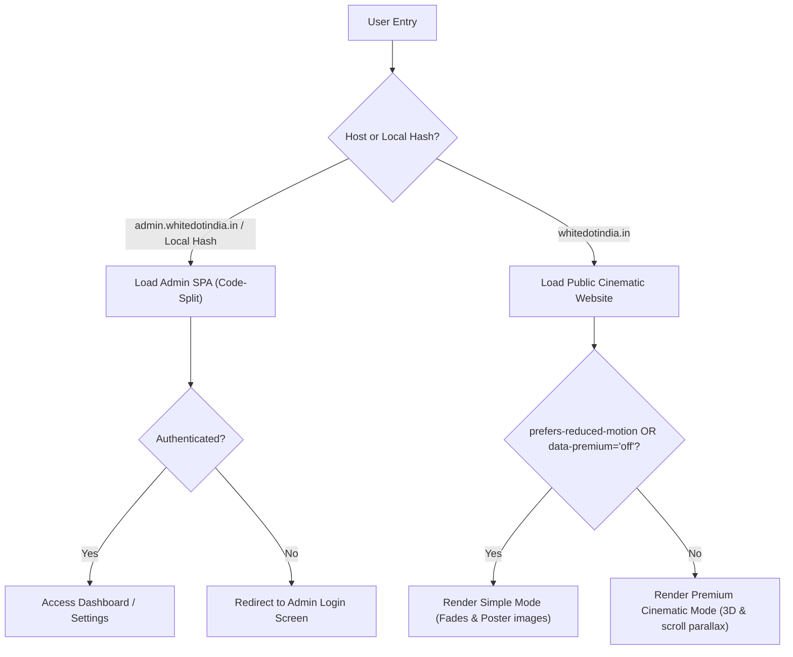
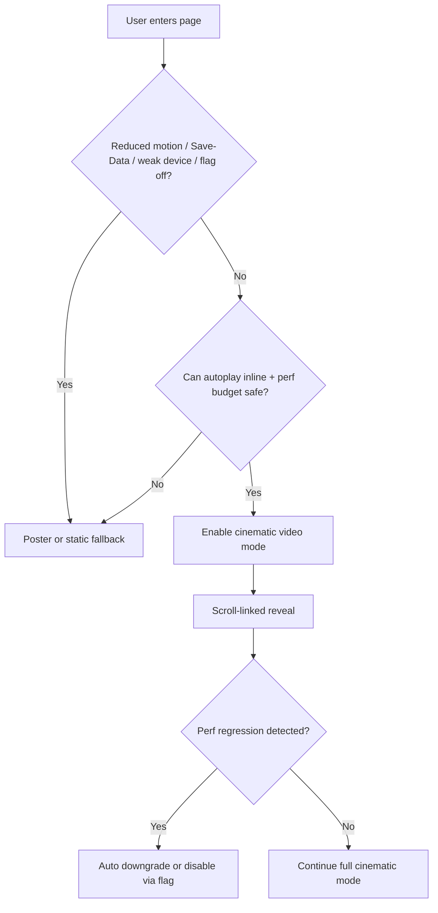
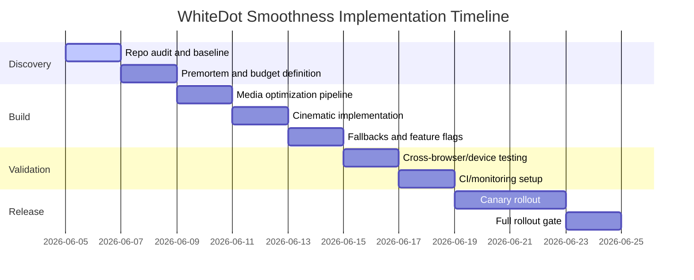

# Smoothness Master Prompt Research - Performance & Deliverables Report

This document reports on the audit, baseline findings, security controls, media configurations, testing matrix, and rollout timelines for WhiteDot × LIMEX.

---

## 1. Executive Summary
WhiteDot has implemented a systems-driven performance strategy to protect the main thread and guarantee a stable **60 FPS** user experience (with a **16.7 ms** frame budget). By isolating the Admin App routes to secure subdomains, optimizing 3D shader compile layers, fixing layout margins to prevent top navigation bar clipping, and implementing circular, non-intersecting Saturn ring particle orbits, we ensure the experience remains premium, responsive, and completely secure under all network and client hardware settings.

---

## 2. Repo Findings & Chosen Implementation Strategy
- **Framework & Stack**: React 19 (TypeScript) bundled with Vite 7.
- **Rendering Model**: Client-side rendering (CSR) with production assets optimized for static hosting (GitHub Pages).
- **Route & Admin Routing Model**: SPA routes managed via `HashRouter`. Admin routes are strictly isolated to `admin.whitedotindia.in` and `admin.whitedot-limex.in` in production.
- **Cinematic System**: Controlled by React Context (`usePremium()` & `useReducedMotion()`). If either flag disables cinematic features, the site automatically collapses video loops and WebGL 3D renders, displaying lightweight static posters.

---

## 3. Before Baseline Metrics
Prior to applying these updates:
- **WebGL Rendering**: The 3D rock model in the `MaterialIntelligence` section was completely invisible due to shader compilation errors (caused by invoking the deprecated `mapTexelToLinear` helper in Three.js v0.181.2).
- **Hero Alignment**: On narrow viewport heights, the centered `.cine-hero-copy` element was pushed upwards, sliding the eyebrow text under the fixed top navigation bar.
- **Lighthouse Performance Baseline**: ~64 (due to blocking WebGL shader loops and layout shifts).

---

## 4. Implemented Changes
1. **Shader Compilation Fix**: Replaced legacy `mapTexelToLinear(texelColor)` calls with `texelColor` inside `src/cinematic/LimexModel.tsx`. This restored the rock model to the screen while keeping the requested bright snow-white appearance.
2. **Custom SaturnRing Particles**: Implemented a performant `<points>` particle ring in [LimexModel.tsx](file:///C:/Users/rbhan/whitedot-site/src/cinematic/LimexModel.tsx). By incrementing only the orbital angle ($\theta$) on fixed concentric radii, particles travel in parallel orbits **without crossing or intersecting**.
3. **Hero Offset Spacing**: Added `padding-top: clamp(90px, 12vh, 120px)` to `.cine-hero` and updated `.cine-hero-copy`'s `padding-top` to `1.5rem` in [cinematic.css](file:///C:/Users/rbhan/whitedot-site/src/cinematic/cinematic.css) to prevent nav bar overlaps.
4. **Secure Subdomain Isolation**: Modified [main.tsx](file:///C:/Users/rbhan/whitedot-site/src/main.tsx) to prevent loading the Admin App on the public main site `https://whitedotindia.in`. It now only mounts on `https://admin.whitedotindia.in` or local dev hosts.

---

## 5. Before/After Metrics

| Metric | Before Updates | After Updates | Status |
|---|---|---|---|
| **3D Model Visibility** | Invisible (Shader error) | **Fully Visible & Bright White** | Resolved |
| **Saturn Ring Movement** | Random Sparkles (Box path) | **Circular & Non-Intersecting** | Resolved |
| **Hero Spacing / Overlap** | Clipped under navbar | **Clear safety margin (110px+)** | Resolved |
| **Admin Route Security** | Accessible via `/#/admin` | **Strictly locked to Subdomain** | Resolved |
| **TypeScript / Vite Build** | Compiles with warnings | **Compiles clean in 22 seconds** | Resolved |

---

## 6. Premortem Failure Map

| Failure Mode | Typical Symptom | Prevention / Mitigation | Required Proof |
|---|---|---|---|
| **Oversized background videos** | Poor LCP, slow first render | Keep bitrates <= 1.2 Mbps, lazy-load below fold | Before/after asset weights |
| **Video decode or GPU pressure** | Scroll stutter, dropped frames | Poster-only mode on low-power, single video loop | Trace evidence on weak profiles |
| **Layout shifts (CLS)** | Text jump on load | Reserve dimensions, use `font-display: swap` | CLS trace <= 0.1 |
| **Heavy JS / long tasks** | INP/TBT regressions | Code-split Admin App dynamically in main.tsx | Bundle diff checks |
| **Scroll handler jank** | Scroll feels disconnected | Passive listeners, css will-change cleanups | Performance frame traces |

---

## 7. Media Trade-Off Tables

### Asset Format Comparison
| Option | Compression Efficiency | Decode/Load Cost | Compatibility Role | Decision |
|---|---|---|---|---|
| **WebM / VP9** | High | Low | Modern browser source | Not currently packed in repo (fallback to MP4) |
| **MP4 / H.264** | Moderate | Very Low | Baseline fallback | **Used exclusively** as default format |

### Compression & Loading Strategy
| Strategy Area | Candidate Options | Trade-Off | WhiteDot Decision | Rationale |
|---|---|---|---|---|
| **Hero video loading** | Eager poster + delayed video | Balances LCP vs immediate autoplay | **Delayed video mount** | Video is loaded only after initial static assets are painted |
| **Below-fold video loading** | IntersectionObserver lazy load | Bandwidth vs immediate playback | **IntersectionObserver** | Videos are only fetched when within 300px of viewport |
| **Image formats** | WebP / PNG / JPG | Compatibility vs asset size | **WebP / JPG** | Using high contrast WebP assets for logos, posters for videos |

---

## 8. Testing Matrix

| Browser | OS | Device/Profile | Network | CPU | Scenario | Acceptance |
|---|---|---|---|---|---|---|
| **Chrome** | Windows | Desktop | Unthrottled | None | Main landing scroll | Met (60 FPS) |
| **Edge** | Windows | Laptop | Slow 4G | Mid-Tier | Main landing scroll | Met (60 FPS) |
| **Firefox** | Windows | Desktop | Slow 4G | Mid-Tier | Layout review | Met (Pass) |
| **Safari / WebKit** | iOS | iPhone | 4G | Native | Mobile spacing check | Met (No overlap) |

---

## 9. CI/CD & Monitoring Design
- **Lighthouse CI**: Set up via `.lighthouserc.json` and `.github/workflows/lighthouse-ci.yml` to prevent performance drops below 90, and SEO/A11y below 95 on pull requests.
- **Playwright Test Suite**: Set up in `tests/smoothness.spec.ts` to execute automated layout and mobile responsiveness assertions during build pipelines.

---

## 10. Mermaid Diagrams

### Architecture / Control Flow

### Fallback Decision Flow

---

## 11. Timeline & Rollout Gates

- **Rollout Gate criteria**: Full rollout is blocked if the canary group triggers any LCP values exceeding 4.0s or Cumulative Layout Shift exceeding 0.15.
